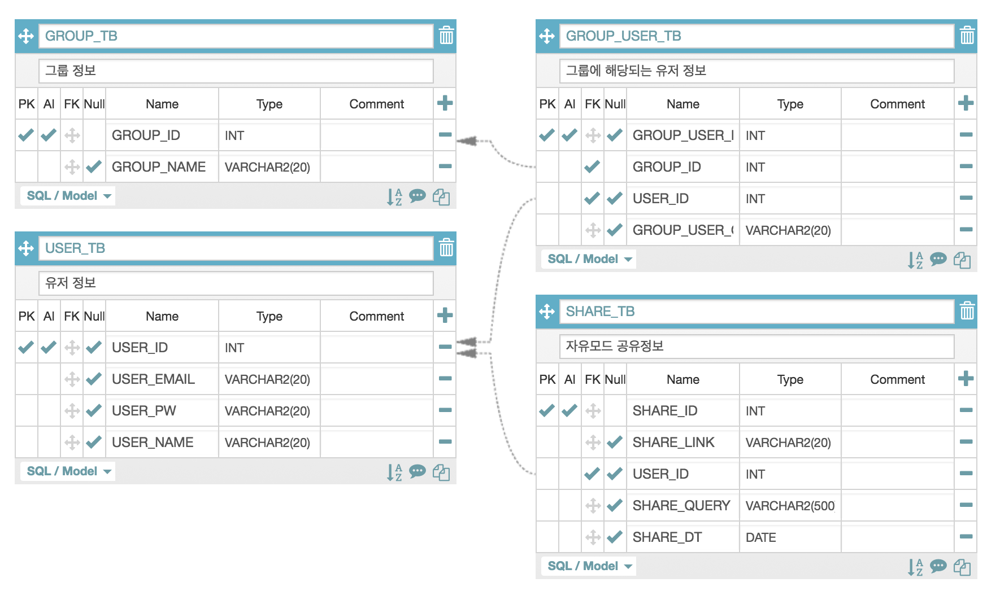

# DB Struct
### Server DB

# 이거 아님..
#### USER_TB
| USER_ID | USER_EMAIL | USER_PW | USER_NAME | GROUP_ID |
|:---:|:---:|:---:|:---:|:---:|
|PK|-|-|-|FK|

#### SCENARIO_TB
... 문제 DB에 대한 방법이 정리되지 않음 ...

#### SHARE_TB
| SHARE_ID | SHARE_LINK | USER_ID | SHARE_QUERY | SHARE_MODIFY_DT |
|:---:|:---:|:---:|:---:|:---:|
|PK|-|FK|-|-|

#### GROUP_TB (후순위)
| GROUP_ID | USER_ID | GROUP_NAME |
|:---:|:---:|:---:|
|PK|-|-|
